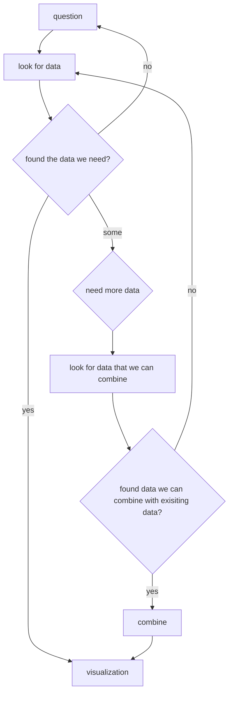

# Data Visualization

## Overview

Think about a question that can be explored through data and explained through a visualization. Then find and construct a dataset (or datasets) that you will use to build visualizations from. 

The question we've been exploring thus far has been: 

> _What have been the lasting impacts of Redlining_?

Then we collected and combined data to create visualization about how current populations in Redlined areas are currently distrubted and what the relative values of houses currently are in redlined areas. 

## Generating the Question and Finding the Data

It would be nice if we could generate a good question and then always have at hand the data needed to explore that question, but that is a large ask. Sometimes the data we need just isn't available. At the same time, we don't want to simple find a dataset and make up questions that data can answer-- that feels inauthentic. So, this will need to be a somewhat interative process. 

You might find some of the data you need in one data set, and some other data you need in a different data set. If you can combine those sources somehow, that's great. If you can't, you might need to find a different data set, or some sort of intermediate data set. Don't underestimate this step, and do all that you can to remain authentic through your various iterations. 

Also, don't underestimate the fact that you might need to manually create some of these datasets by _scraping_ data from websites. 

Some other example questions: 

* What is the healthiest food? 
* Who is the best player in <_whatever league_>?
* What is the effect of the number of daylight hours on the temperature in Fort Washington?
* [What are the possible outcomes for World Cup group play participants after two games](https://www.nytimes.com/interactive/2022/upshot/world-cup-standings.html)?

## Visualize

After you have your data, you'll want to think about how you want to visualize it in a way that explores your question. For instance, we used pie charts and different colorized bar graphs to explore relative porportions and ranked values, respectively. The _New York Times_ used a colorized grid for its World Cup outcomes piece. But maybe you'd want to use a Spider Web Graph to compare different items:

Or a Sankey Diagram to show how values evolve over time. 

What is important to note that in all of those examples, there are simple, primitive shapes at the heart of them (lines, circles, squares, etc.)[^1]

You should _iteratively produce_ rough drafts for what you want your visualizations to look like _before_ you start coding them. You know that you have the ability to draw primitive shapes, so construct your rough drafts with those shapes. Once you have something solid to work from, then you can begin working on the code to display it. 

## Code! 

If you need to combine or filter datasets, remember that you'll either need to do this manually, semi-manually (using a tool like Excel or Google Sheets), or via a program. Regardless, make sure you document how you 

Regardless of your dataset, I highly recommend working with a subset of it while you develop your code (make a new version of your data, cut out a large portion of it, and use that while coding. 

## Requirements

### General Project Requirements
* Describe the process of developing and refining your question in your [Documentation of Progress](progress.md)
* You will provide sources for your data in your Documentation of Progress
* Provide the iterative rough drafts of your visualizations by adding screen shots, photos, etc. to your project and link them in your Documentation of Progress
* Describe how you combined or filtered your data sources to produce the data you ended up using in your Documentation of Progress
* Complete the [Summary of Unit Work](summary.md)

### Data and Visualization Requirements
* Your _original_ data set must be large. This is obviously a somewhat ambigious requirement and it will be somewhat dependent on your question. Further, the data you ended up displaying may be aggregated in the end. For instance, in the Sankey diagram above, the final dataset for display was only 25 lines or so (five grades `x` five grades). 
* Your visualization needs to be multi-dimensional in some fashion. For instance, a pie-chart is one dimensional. It displays the distribution of a group of things. Four pie charts displayed alongside a baseline pie chart is multi-dimensional. A bar chart is one dimensional. It displays relative values next to one another for comparison. Coloring those bars in order to establish a relationship between the values is multi-dimensional. 
* Your visualization needs to be understood without any outside information. This might mean you need things like, titles, labels, keys, scales, etc. 

### Additional Honors Requirements
* Your visualization needs to have a dynamic element. For instance, if we were to remake the _NYT_ visualization, a user should be able to select a team or cycle through all the teams. Obviously, this interactive element needs to either be intuitative, or your program needs to display instructions for its use.  

<!--- Footnotes Below --->

[^1]: Okay, admittedly, the primitive shape in use for the Sankey Diagram is not obvious at first, but in the end, it turns out to be lines. Lots of lines 1 pixel wide. 
